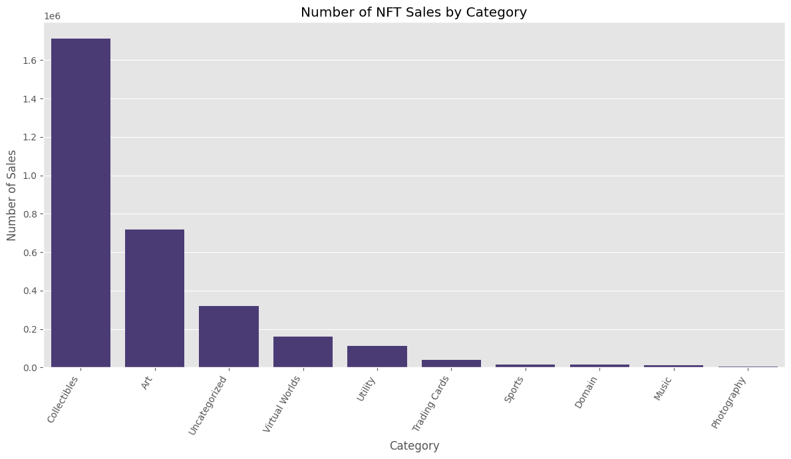

# NFT Sales and Category Analysis: Insights from OpenSea Data 2019-2021

## Project Objective
This project aims to analyze sales data from the OpenSea NFT marketplace to understand the dynamics and trends across different NFT categories. The primary goal is to identify which categories drive the most sales volume, generate the highest revenue, and command the highest average prices, providing actionable insights for artists, investors, and platform developers.

## Data Source & Tools Used
* **Data Source:** The dataset used for this analysis comprises all successful NFT sales from OpenSea between January 2019 and December 2021. This data was originally sourced from the OpenSea API and made available on Kaggle.
* **Tools Used:**
    * **Python:** For data manipulation, analysis, and visualization.
    * **Pandas:** Essential for data loading, cleaning, and transformation.
    * **Matplotlib & Seaborn:** For creating compelling data visualizations.
    * **Google Colab:** As the development environment for running the Python code.

## Key Preprocessing Steps
Before analysis, the raw data underwent several crucial preprocessing steps:
* **Data Loading:** The CSV file was loaded into a Pandas DataFrame.
* **Data Type Conversion:** The `total_price` column, initially in 'Wei' (a small unit of Ether) and stored as an object type, was converted to a numerical (float) type and then scaled to 'Ether' for readability and meaningful calculations.
* **Datetime Conversion:** The `sales_datetime` column was converted to a datetime object, enabling time-series analysis and extraction of features like `sale_year`, `sale_month`, and `sale_day_of_week`.
* **Handling Missing Values:** Rows with non-convertible price data were dropped, and other missing values were noted for potential future handling, though not critical for the core analysis.
* **Category Filtering:** The dataset was filtered to include all relevant NFT categories, ensuring a comprehensive market overview.

## Key Findings
Our analysis of OpenSea NFT sales data from January 2019 to December 2021 revealed significant insights into the market dynamics across different categories:

* **Collectibles Dominate Sales Volume:** The "Collectibles" category recorded the highest number of sales by far (over 1 million transactions), highlighting its widespread popularity and accessibility within the NFT market. This indicates a high demand for character-based or collection-driven NFTs.
* **"Uncategorized" and "Virtual Worlds" Lead in Revenue:** While "Collectibles" had the highest transaction count, the "Uncategorized" and "Virtual Worlds" categories generated the largest total revenue in Ether. The "Uncategorized" category, in particular, showed an exceptionally high total revenue (billions of Ether), suggesting it might contain a few extremely high-value outlier transactions or significant projects that were not clearly categorized. "Virtual Worlds" (e.g., virtual land, metaverse assets) also demonstrated substantial financial value.
* **Highest Average Prices in Niche Categories:** Consistent with total revenue, "Uncategorized" and "Virtual Worlds" also commanded the highest average sale prices per NFT. This indicates that buyers are willing to pay a premium for assets in these specialized or high-value segments.
* **Art, Photography, and Music: Lower Volume, Niche Appeal:** Traditional art forms like "Art," "Photography," and "Music" NFTs, while significant culturally, accounted for a smaller proportion of overall sales volume and total revenue compared to "Collectibles" or "Virtual Worlds." Their average sale prices were also comparatively lower, suggesting a more niche market or a larger number of lower-priced entries by new artists.
* **Explosive Market Growth in 2021:** The data clearly shows an exponential growth in both the number of sales and total revenue across almost all categories during 2020, peaking dramatically in 2021. This reflects the mainstream adoption and rapid expansion of the NFT market during this period. "Collectibles" and "Art" primarily drove the increase in sales volume, while "Uncategorized" and "Virtual Worlds" were key contributors to the overall revenue surge.

## Visualizations
Below are the key visualizations generated during this analysis, illustrating the findings discussed above.

### Number of NFT Sales by Category

*(This bar chart effectively visualizes the total count of NFT sales for each category from 2019 to 2021, clearly demonstrating "Collectibles" dominance in transaction volume.)*

### Total NFT Revenue (in Ether) by Category
.png)

*(This bar chart illustrates the cumulative revenue in Ether generated by sales in each NFT category. It highlights "Uncategorized" and "Virtual Worlds" as the primary revenue drivers, indicating high-value assets within these segments.)*

### Average NFT Sale Price (in Ether) by Category
.png)

*(This bar chart displays the average sale price in Ether for NFTs across different categories. It shows that "Uncategorized" and "Virtual Worlds" command significantly higher average prices per NFT.)*

### Annual Trend of NFT Sales by Category
.png)

*(This line chart visualizes the annual evolution of NFT sales counts for each category, clearly depicting the explosive market growth witnessed in 2021 across most categories, with "Collectibles" and "Art" showing substantial increases.)*

### Annual Trend of NFT Revenue (in Ether) by Category
.png)

*(This line chart illustrates the annual trend of total revenue in Ether for each NFT category. It further emphasizes the dramatic market expansion in 2021 and the significant financial contribution from "Uncategorized" and "Virtual Worlds" during this period.)*

## Recommendations
Based on these findings, we offer the following recommendations for different stakeholders in the NFT ecosystem:

* **For Artists:**
    * Consider exploring the **"Collectibles"** market, as it demonstrates the highest sales volume and broad appeal. Artists can develop unique character sets or series that resonate with collectors.
    * For those in traditional **"Art"** or **"Photography"** categories, focus on building strong communities and leveraging unique value propositions to stand out in a more competitive segment with lower average prices. Niche markets within these categories could also be explored.
* **For Investors:**
    * While **"Collectibles"** offer high liquidity due to frequent sales, **"Virtual Worlds"** and potentially high-value assets within **"Uncategorized"** categories present opportunities for significant average returns, although they might come with higher risk due to lower transaction volumes.
    * **Monitor market trends closely:** The rapid growth in 2021 suggests a volatile market. Diversifying across categories and understanding the underlying utility or community of an NFT can mitigate risks. Diligent research into specific projects within high-value categories is crucial.
* **For NFT Platforms & Marketplaces:**
    * **Improve categorization:** The large "Uncategorized" segment suggests a need for more granular or clearer categorization tools to help buyers and sellers navigate the market more effectively and understand true market value. Better classification can enhance user experience and market transparency.
    * Highlight top-performing collections and categories to guide new users and foster market activity, potentially creating dedicated sections or filters for trending styles.

## Conclusion
This project successfully analyzed the dynamics of the OpenSea NFT market, identifying key trends in sales volume, revenue, and pricing across various categories. The insights gained highlight the dominance of Collectibles in transaction numbers, the high-value nature of Virtual Worlds, and the significant overall market growth. This analysis serves as a foundational understanding for navigating the complex and rapidly evolving NFT landscape.

## Future Work
* Conduct a deeper dive into the "Uncategorized" category to identify specific high-value assets or underlying commonalities.
* Analyze specific high-performing collections within the "Collectibles" and "Virtual Worlds" categories (e.g., CryptoPunks, Bored Ape Yacht Club, Decentraland).
* Incorporate external data such as social media sentiment, economic indicators, or gas prices to build a more comprehensive predictive model for NFT value.
* Explore more advanced statistical modeling techniques to predict future sales trends or identify factors influencing price appreciation beyond categorization.
